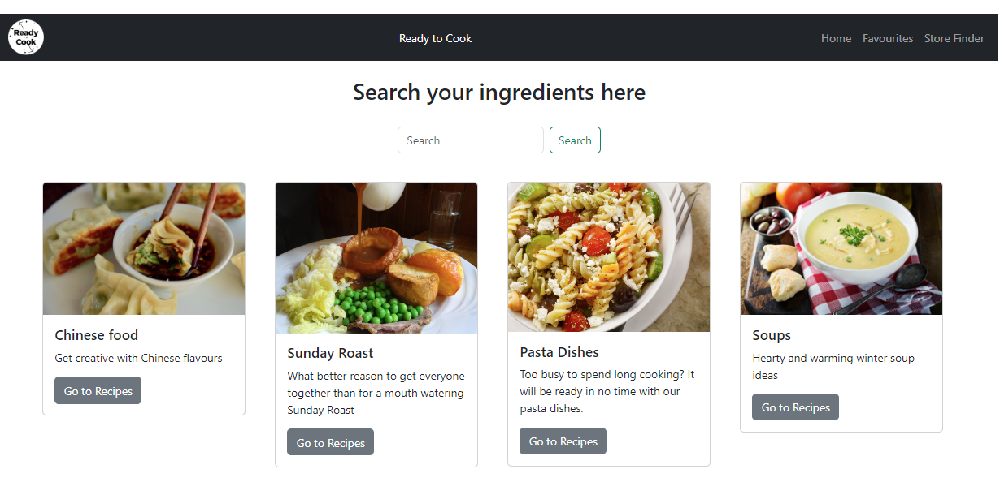
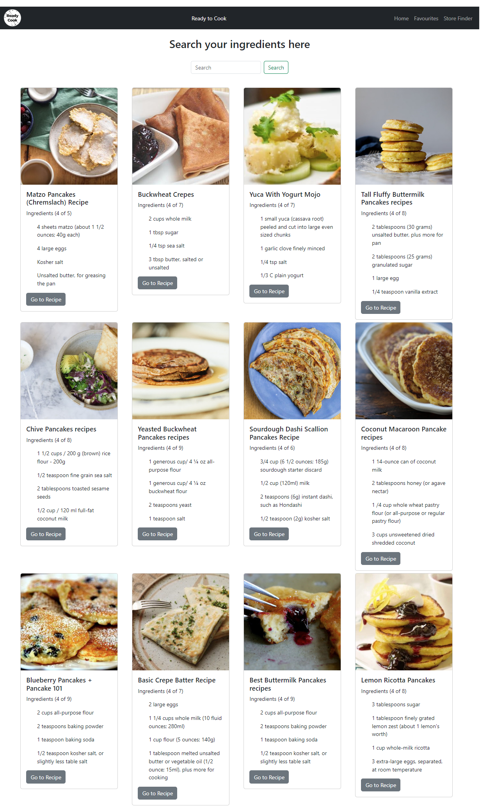
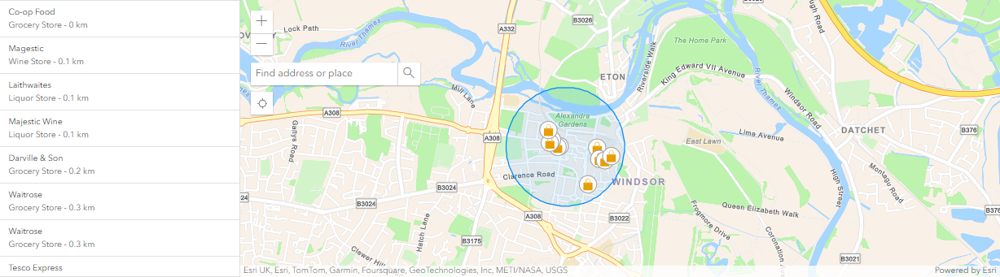

# Ready-To-Cook

## Description
"Ready to cook" is all about cooking your own food by searching for recipes with the ingredients you have to hand.

## Table of Contents
* [Links](#links)
* [Installation](#installation)
* [Usage](#usage)
* [Screenshots](#screenshots)
* [Project Items](#project-items)
* [License](#license)
* [Features](#features)

## Links
* [Repo](https://github.com/swathi-mungala/Ready-To-Cook)
* [Live](https://swathi-mungala.github.io/Ready-To-Cook/)

## Installation
aaaa

## Usage
### Recipe Search Screen
When opened, the screen will display a navigation bar, a search box and 4 "quick find" buttons.

#### Navigation Bar
Common across all pages (#ToBe) of the site. The navigation bar provides 3 options on the right. 

* Home - When selected will go to the site home page
* Favourites - When selected will display the previosuly saved recipes (#ToBe)
* Store Finder - When selected will open a new tab with the ability to search for local stores

#### Quick Find Buttons
 
Located beneath the search box, these randomly selected items will, when "Go to recipes" is clicked, search for a list of associated recipes. The quick find buttons will be removed and replaced with the recipes.

#### Search
 
In this box you may enter your ingredients that you have. Clicking the search button will then retrieve a list of recipes that have the entered words.

When the search is performed, the quick find buttons will be replaced and cards of recipes will be displayed. The information initially provided is an image of the recipe, it's title and a list of the ingredients (up to 4). A button is also provided which, when clicked, will open a new browser tab with the complete recipe.
#### Example recipe card:
</img>

### Store Finder
The store finder will initially open with the mapped zoomed in to Windsor.

#### Finding a place
* The locator button </img> will display the locality that the system detects that you are in.
* The search function </img> will allow you to type in a town/city/village/etc. and display that area.

#### Displaying stores                            
When the map is clicked, this will define the centre point for a 500m circle. A search will then be automatically performed for any convenience stores within this area.  If any are found their locations will be shown on the map  </img>  and brief details will be displayed in the results pane </img> 
Clicking on an item in the results pane will display further information about the store and allow the store to be zoomed in to on the map.

## Screenshots
### Initial Home screen
</img>
### Screenshot 2 - Recipe Search
</img>
### Initial Store Finder
</img>
### Store Finder with Results
</img>

## Project Items
### Screen Designs

### Kanban Board
(https://github.com/users/TraceyPen/projects/2)

## License
MIT License as per repository.

## Features
JavaScript, notably:
- APIs (firstapi.com & thisotherapi.org)
- Bootstrap

## Acknowledgements
Thanks to:
* Bootcamp Lessons
* Tracey, Swathi, Duncan

© 2024 edX Boot Camps LLC. Confidential and Proprietary. All Rights Reserved.
